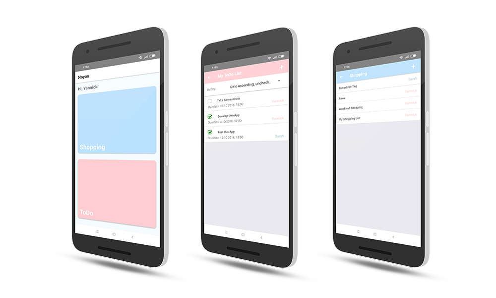

# Noyou


Noyou is an Android App that lets you manage shopping and todo lists with multiple people. It is made with React Native and communicates through sockets with a Node Server. Data is stored in a Google Firebase Firestore. This Readme describes how to set up the App for yourself.

Please note that this is passion/practice project that I made for my girlfriend and myself so I did not bother with an account managing system. All list entries  are public to all users of the same Server and Database. 




## Server

The Node server consists of two files.

`index.js` sets up the socket conntctions and reacts to incoming messages. It uses `data.js` to interact with a database.

###Using a Firestore database

I chose Firestore as a database. If you want to go the same route, follow [this guide](https://firebase.google.com/docs/firestore/quickstart) to create a Firebase project with the Firestore database. Follow the steps until you created a privete key and downloaded the provided JSON file.

Put this file under a `google` directory within the `NoyouServer` directory (`NoyouServer\google\<YOUR KEY.json>`).

Open `index.js` and replace 

```javascript
const db = new firestore({
  projectId: '<YOUR PROJECT ID>',
  keyFilename: '<YOUR KEYFILE>',
});
```

with your data.

### Using your own database

Alternatively you can use any database you want and replace the function bodies of the `data.js` with logic to correspond to your chosen database. 

The required database fields are described as comments above the create functions in `index.js`


## App

After the server is hosted (personal recommendations: [zeit](https://zeit.co/) or [netlify](https://www.netlify.com/)) you have to set the URL to which the App should connect to.

Open `App.js` and replace all occurrences of `<YOUR SERVER URL>` with the actual URL of your server.

To generate a signed APK follow the [React Native Guide](https://facebook.github.io/react-native/docs/signed-apk-android) to create your own keystore and set your keystore path and password in the `gradle.properties` file.

Everything else is already set up. Run the following commands to create the APK:

```bash
$ cd android
$ ./gradlew assembleRelease
```

